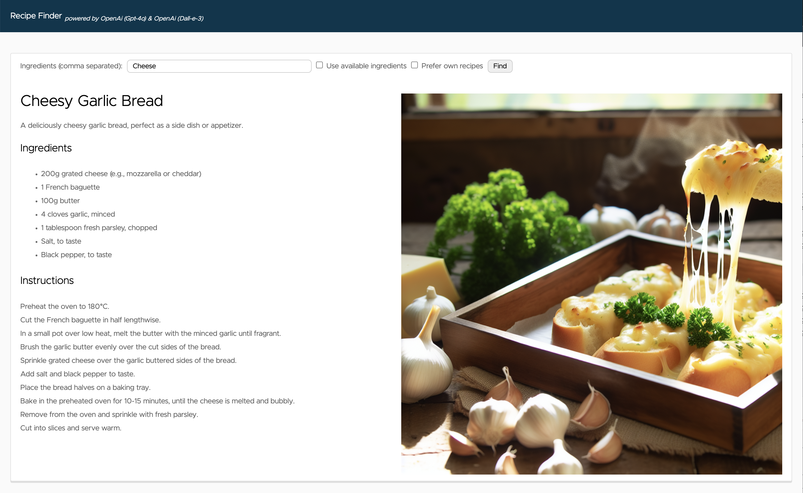
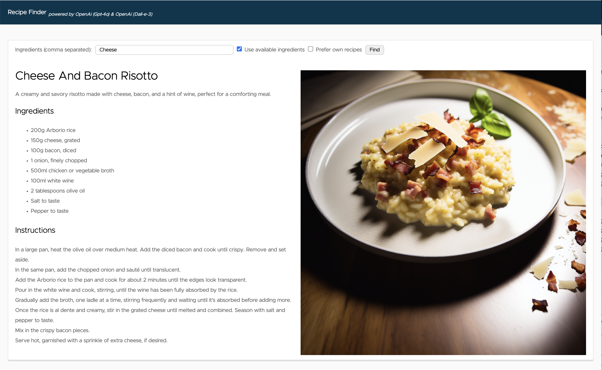
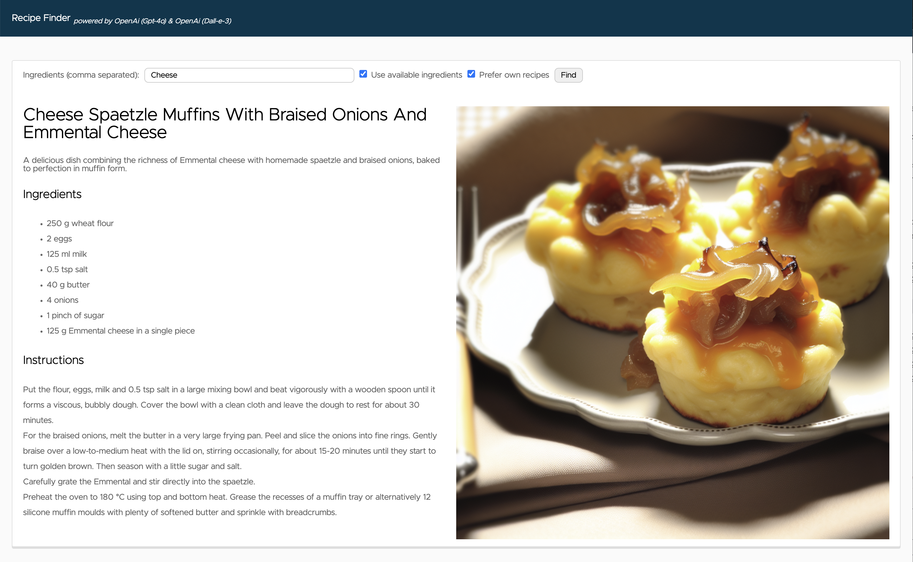

# Spring AI Recipe Finder MCP

This sample code demonstrates how to implement [Model Context Protocol (MCP)](https://modelcontextprotocol.io/introduction) clients and servers with Spring AI. 

MCP is an open protocol that standardizes the connection between AI models and various data sources and tools, enabling developers to create agents on top of LLMs. MCP follows a client-server architecture, where an AI application  (MCP host) communicates through embedded MCP clients to MCP servers to access specific resources or functionalities. 

*Note: A Spring AI Recipe Finder implementation without MCP is available [here](https://github.com/timosalm/spring-ai-recipe-finder).*




# Setup
## LLM
Currently Ollama, OpenAI, and Azure OpenAI are supported AI providers.

### Local LLM (Ollama)
As Ollama doesn't yet provide a text-to-image model, recipe image generation is not available with this setup. 
From version 3.1 Llama is supporting Function Calling even if it's not working well with the small models.

Even if an option is provided to start and configure a Llama 3.2 instance with docker compose, depending on your system (e.g. ARM macs) this is not a recommended setup due to performance reasons.

To run a Llama 3.2 instance on your local machine without a container, [download and install the latest Ollama release](https://ollama.com/).
Pull the llama3.2 model (Ollama 0.2.8 or newer, and Llama 3.1 or newer is required for Function Calling)
    ```
    ollama pull llama3.2
    ```

### Azure OpenAI
Make sure the deployment names of the models match exactly what's in your application-azure.yaml configuration files.

Currently, [**only some regions support image generation** with Dall-E](https://learn.microsoft.com/en-us/azure/ai-services/openai/concepts/models#dall-e-models).
If you use a region that doesn't support it, you have to disable the image generation by setting `ai.azure.openai.image.enabled: false` in the application-azure.yaml configuration files to not run into errors.

### Vector DB
On your local machine, a Redis database is automatically started and configured with Docker Compose for the favorite-recipes-server. As a fallback if no Redis database is configured, a SimpleVectorStore instance will be used.

# Running the application

## Locally

### Docker Compose
The easiest way to run the application is via Docker Compose.

#### Local LLM (Ollama) 
```
/run-local.sh
```

#### Local LLM (Ollama) in container
```
/run-local.sh ollama-container
```

#### OpenAI
```
export SPRING_AI_OPENAI_API_KEY=<INSERT KEY HERE>
export SPRING_PROFILES_ACTIVE=openai
/run-local.sh
```

#### Azure OpenAI
```
export SPRING_AI_AZURE_OPENAI_API_KEY=<INSERT KEY HERE>
export SPRING_AI_AZURE_OPENAI_ENDPOINT=https://{your-resource-name}.openai.azure.com
export SPRING_PROFILES_ACTIVE=azure
/run-local.sh
```

### In the terminal
You can also run the applications in different terminal sessions. Just run the following commands for each sub directory (fridge-server, favorite-recipes-server, recipe-finder-client) in a seperate terminal sessions.

### Local LLM (Ollama) 
```
SPRING_DOCKER_COMPOSE_ENABLED=false # If want to use the SimpleVectorStore instead of Redis running in a container
./gradlew bootRun
```

### OpenAI
```
export SPRING_AI_OPENAI_API_KEY=<INSERT KEY HERE>
export SPRING_PROFILES_ACTIVE=openai
./gradlew bootRun
```

### Azure OpenAI
```
export SPRING_AI_AZURE_OPENAI_API_KEY=<INSERT KEY HERE>
export SPRING_AI_AZURE_OPENAI_ENDPOINT=https://{your-resource-name}.openai.azure.com
export SPRING_PROFILES_ACTIVE=azure
./gradlew bootRun
```

## Kubernetes Deployment (WIP)

# Using the application

Open [http://localhost:8080](http://localhost:8080) in your browser. 
Enter the ingredients (e.g. "Potatoes") you want to find a recipe for in the form and press the "find" button.

## Function Calling 
By checking the "Prefer available ingredients" checkbox, [Function Calling](https://docs.spring.io/spring-ai/reference/1.0/concepts.html#_function_calling) will be enabled.
As the functionalities to add always available ingredients and for the API call to check the available ingredients in the fridge are not yet implemented, they can be configured via the `app.available-ingredients-in-fridge` property in [fridge-server's application.yaml](fridge-server/src/main/resources/application.yaml).

Bacon and onions are currently configured for available ingredients in fridge.
With the input "Potatoes", you should get a recipe with potatoes and bacon.


## Retrieval-Augmented Generation(RAG)
By checking the "Prefer own recipes" checkbox, [Retrieval-Augmented Generation](https://docs.spring.io/spring-ai/reference/1.0/concepts.html#concept-rag) will be enabled.

To upload your own PDF documents for recipes to the vector database, there is a REST API endpoint implemented. 
```
curl -XPOST -F "file=@$PWD/german_recipes.pdf" -F "pageBottomMargin=50" http://localhost:8082/api/v1/recipes/upload
```
The sample recipe part of this repository is a potato soup. With the input "Potatoes", you should get a recipe that goes in the direction of a potato soup.
